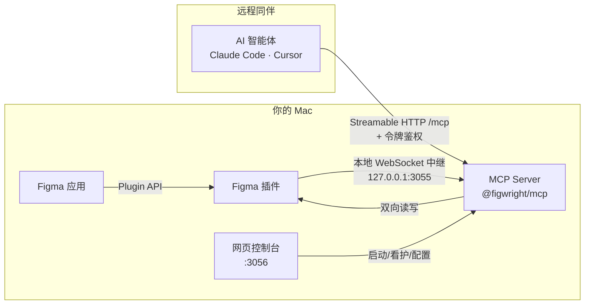

<div align="center">

# Figwright Plus

**让 AI 智能体真正「驾驶」你的 Figma —— 无论在你的 Mac 上，还是隔着局域网的另一台电脑。**

一个自托管的 **Figma ↔ MCP** 桥接服务：本地 MCP Server 连接你机器上的 Figma 插件，AI 智能体（Claude Code、Cursor 等）就能读取设计稿生成代码，或把代码推回画布；再配上网页控制台、远程协作、按同伴分权的令牌体系。

[](./LICENSE)
[](./docs/使用指南.md)
[](./docs/使用指南.md)
[](./docs/使用指南.md)

</div>

> 📘 **文档**
> - 🀄 中文使用指南：**[`docs/使用指南.md`](./docs/使用指南.md)**（详细、一步步上手）
> - 🌐 English Guide：**[`docs/Usage-Guide.md`](./docs/Usage-Guide.md)**（separate file, English only）
>
> 本文档为中文主说明；英文完整内容见上方 English Guide，两份指南互不混写。

---

## ✨ 它是什么

Figwright Plus 在你的电脑上架起一座桥：

- **本地 MCP Server** 连接你机器上的 **Figma 插件**，让 AI 智能体真正「操作」Figma——把选区读成框架感知的代码，或把代码画回画布——而不只是「看一眼」。
- 在这座核心桥之上，Figwright Plus 补上了团队真正用得上的能力：**网页控制台**统一管理整套服务、**远程 MCP** 让同伴的智能体直连你的 Figma、**按同伴分发的令牌**做精细权限控制、**结构化审计**记录每一次调用。

> 全程运行在你自己的机器上，通过 Figma 官方 Plugin API 通信——**无需 Figma Dev Mode 席位，也无需付费套餐**。

## 🏗️ 工作原理



- **控制台（`:3056`，仅本机）** 启动并看护中继（`:3055`）。
- **本机智能体** 通过 stdio / 本地连接操作；**远程同伴** 通过 HTTP `/mcp` 端点（或 `mcp-remote`）连接。
- 所有会改变 Figma 的请求都需要有效令牌（本机回环连接默认开放）。

## 🎯 核心功能

| 能力 | 说明 |
| :--- | :--- |
| **双向读写** | 上百个 MCP 工具——既能把设计读成代码，也能把代码写回画布。 |
| **栈感知出码** | 复用你真实的项目组件、设计令牌与图标，而非瞎编。 |
| **网页控制台** | 零依赖仪表盘：实时状态、令牌、同伴、审计、日志，一键启停。 |
| **远程协作** | 同伴的 `mcp-remote` / 原生 HTTP 客户端经局域网直连你的中继。 |
| **令牌分权** | 每个同伴可发 **只读** 或 **读写** 令牌，随时轮换、随时撤销。 |
| **审计可观测** | 服务端输出 `[peer]` / `[audit]` 结构化日志，控制台解析成实时动态。 |
| **资源传送** | 内联 / WebDAV / SFTP / 直链，四种方式把生成图交给同伴，凭据永不外泄。 |
| **中英双语** | 控制台与插件均支持 **中文 / English**，偏好本地保存。 |

## 🚀 快速开始

```bash
git clone https://github.com/heyxiaoze/figwright.git
cd figwright                 # 也可改名为 figwright-plus
pnpm install
pnpm build                   # 构建 MCP Server（及插件）
node scripts/dashboard.mjs   # 控制台：http://127.0.0.1:3056
```

然后从最新的 GitHub Release 下载插件（`manifest.json` + `dist/`）并导入 Figma。完整步骤见 👉 [中文使用指南](./docs/使用指南.md)。

## 🔌 远程协作（一句话）

在控制台里为同伴**创建令牌** → 把**你的局域网 IP** 和令牌发给同伴 → 同伴在其 MCP 客户端填 `http://<你的IP>:3055/mcp` 并带上令牌头即可。详见指南的「让远程同伴连上你的 Figma」一章。

## 🔐 安全

Figwright Plus 完全运行在你的机器上。把中继暴露到网络（局域网 / 远程）会**移除默认的回环边界**，因此：

- **任何非回环连接都强制令牌鉴权**。
- 中继对每次请求校验 `Host`（防 DNS 重绑定）与 `Origin`。
- 请将局域网 / 远程模式置于可信网络之后，固定 `FIGWRIGHT_TOKEN`，不要让你的防火墙把 `3055` 端口暴露到公网。

令牌视同密码。Figwright Plus **不替代**你对智能体操作的复核——它的写工具会真实修改你的 Figma 文件。

## ❓ 常见问题

**Q：我必须懂代码才能用吗？**
A：日常使用不需要。克隆、安装、构建、跑控制台、导入插件——指南里有一步步截图级说明。只有高级的资源传送（WebDAV/SFTP）配置才需要懂一点 JSON。

**Q：远程同伴需要装 Figma 插件吗？**
A：不需要。同伴只通过 HTTP 连你的 MCP Server，Figma 插件只装在你（设计者）这一侧。

**Q：没有公网 IP 能远程协作吗？**
A：本版聚焦**局域网**直连。跨公网需要你自行做内网穿透 / 反向代理（不在本项目范围内）。

**Q：本机永远能双向读写吗？**
A：是。本机回环连接始终读写开放；**只有远端同伴**的权限由各令牌的 `readonly` 决定。

## 🙏 致谢与许可

Figwright Plus 是 [**Figwright**](https://github.com/awdr74100/figwright)（作者 [@awdr74100 (Roya)](https://github.com/awdr74100)）的一个 fork，基于 **MIT License**。本项目建立在其优秀工作之上，并感激原作者的开源贡献。

- 原仓库：<https://github.com/awdr74100/figwright>
- 本 fork 仓库：<https://github.com/heyxiaoze/figwright>

我们不定期向上游合并更新。如需官方版本或向上游贡献，请访问原仓库。

## 📄 许可

[MIT](./LICENSE) © Roya —— 见 [LICENSE](./LICENSE)。
