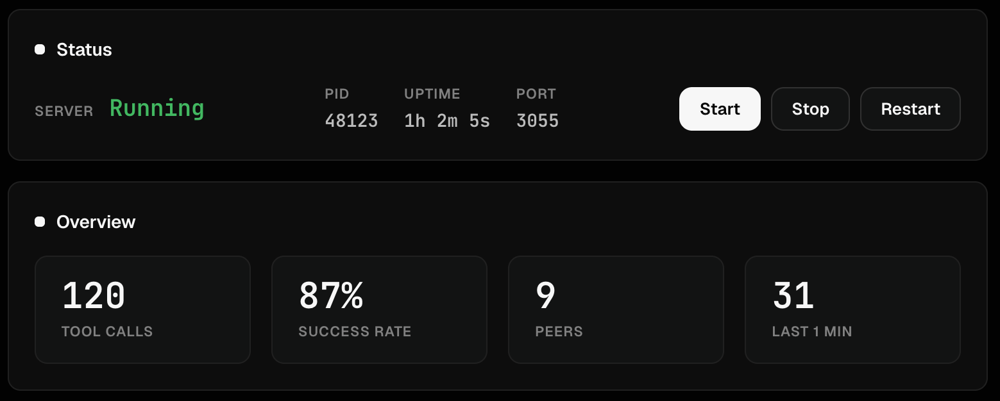
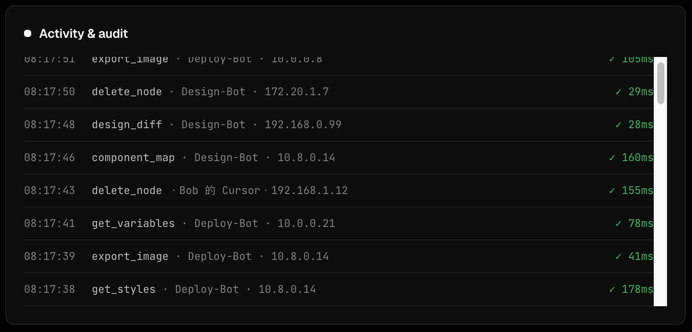
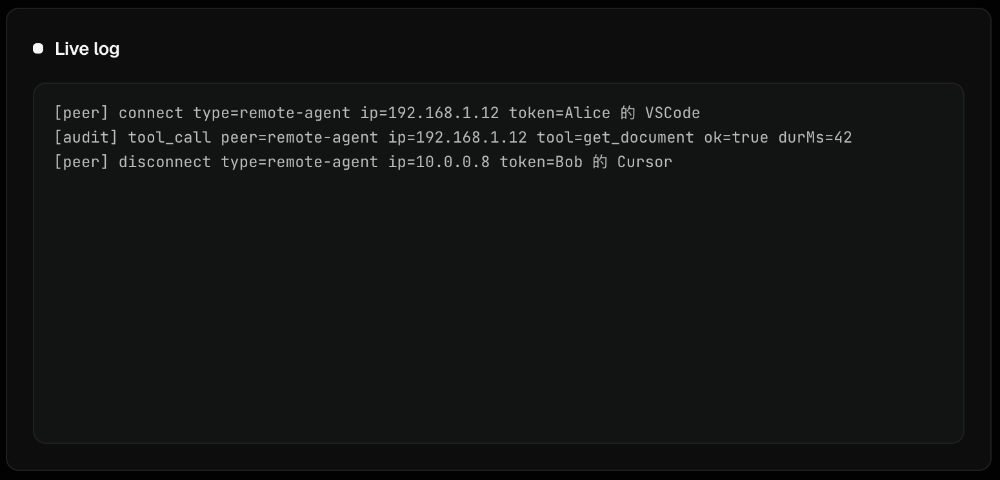

# Console — Web Dashboard Reference

The console (`scripts/dashboard.html`, served at **http://127.0.0.1:3056**) is a zero-dependency web UI to manage the entire Figwright Plus stack from your browser. It starts and supervises the MCP relay, shows live state, and lets you manage tokens, peers, transfers, and audits.

## Sections

### 1. Run state & controls
Shows whether the relay is running, its PID, uptime, listening address, and port. Buttons let you **Start / Stop / Restart** the relay, and edit the binding (host / port) and save — the relay restarts with the new config.

### 2. Overview (stats)
Four hero metrics updated live: total tool calls, success rate, connected peers, and activity in the last minute. A quick read on how busy the stack is.

### 3. Connection & peers
The relay binding (host / port) and the live **peer list** — local plugin, remote plugin, and remote agents, each with connection status. This is where you set the host to a LAN address to accept peers.

### 4. Resource transfer
Choose how generated assets are handed to peers: **Inline** (local), **WebDAV** (zero-dep), or **SFTP** (needs `ssh2-sftp-client`). Each mode has a **Test** button to validate credentials before saving.

### 5. Tokens
Issue, delete, and **rotate** access tokens. Each token is scoped **read-only** or **read-write**, so you control exactly what every peer can do. Copy a peer's `mcp-remote` command straight from here.

### 6. Activity & audit
Call counts, success rate, peer count, last-minute activity, and a live table of tool calls. The server emits structured `[peer]` / `[audit]` log lines that the console parses for this view.

### 7. Live log
The raw relay log with local timestamps. Useful for debugging connections and calls.

## Theme & language

The console has a **light / dark** toggle and a **中文 / English** toggle. Both preferences persist in your browser (`localStorage`).

## Tips

- **Config is local & secret.** Settings live in `scripts/.figwright-dashboard.json` (git-ignored, holds token values). Never commit it.
- **Restart to apply binding changes.** Editing host/port saves to config and restarts the relay automatically.
- **Watch the audit view** when a peer behaves unexpectedly — it shows exactly which tool calls succeeded or failed.
- **Demo mode.** Append `?demo=1` to the URL (`http://127.0.0.1:3056/?demo=1`) to load synthetic peers and a full audit feed through the real render path — handy for checking the layout with lots of data.

---

# 控制台 — 网页仪表板参考

控制台（`scripts/dashboard.html`，运行于 **http://127.0.0.1:3056**）是一个零依赖网页界面，让你在浏览器里管理整套 Figwright Plus：它启动并托管 MCP 中继、展示实时状态，并管理令牌、同伴、传输与审计。

## 各区域

### 1. 运行状态与控制
显示中继是否运行、PID、运行时长、监听地址与端口。**启动 / 停止 / 重启**按钮可管理中继；可编辑绑定（host / port）并保存——中继以新配置重启。

### 2. 运行概览（指标）
四个实时更新的核心指标：工具调用总数、成功率、已连同伴数、近一分钟活动量。一眼看清整套服务有多忙。

### 3. 连接与同伴
中继绑定（host / port）与实时**同伴列表**——本机插件、远程插件、远程智能体，各带连接状态。在此把 host 设为局域网地址即可接收同伴。

### 4. 资源传输
选择生成资源如何交付给同伴：**Inline**（本机）、**WebDAV**（零依赖）、**SFTP**（需 `ssh2-sftp-client`）。每种模式都有**测试**按钮，保存前可校验凭据。

### 5. 令牌
签发、删除、**轮换**访问令牌。每条令牌设为**只读**或**读写**，精确控制每位同伴的权限。可直接从此处复制同伴的 `mcp-remote` 命令。

### 6. 活动与审计
调用数、成功率、同伴数、近一分钟活动，以及实时工具调用表。服务端输出结构化的 `[peer]` / `[audit]` 日志行，控制台据此解析出本视图。

### 7. 实时日志
带本地时间戳的原始中继日志，便于排查连接与调用。

## 主题与语言

控制台提供**亮 / 暗**主题切换与**中文 / English**语言切换，两项偏好均保存在浏览器（`localStorage`）中。

## 小技巧

- **配置是本机机密。** 设置存于 `scripts/.figwright-dashboard.json`（已被 git 忽略，含令牌值），切勿提交。
- **改绑定需重启。** 修改 host/port 会写入配置并自动重启中继。
- **同伴异常时看审计视图** —— 它精确显示哪些工具调用成功或失败。
- **演示模式。** 在网址后加 `?demo=1`（`http://127.0.0.1:3056/?demo=1`）即可通过真实渲染路径载入假同伴与完整审计流——方便检查数据密集时的排版。
