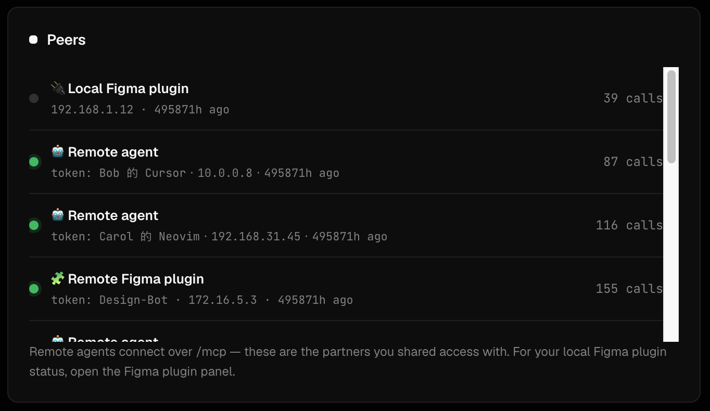
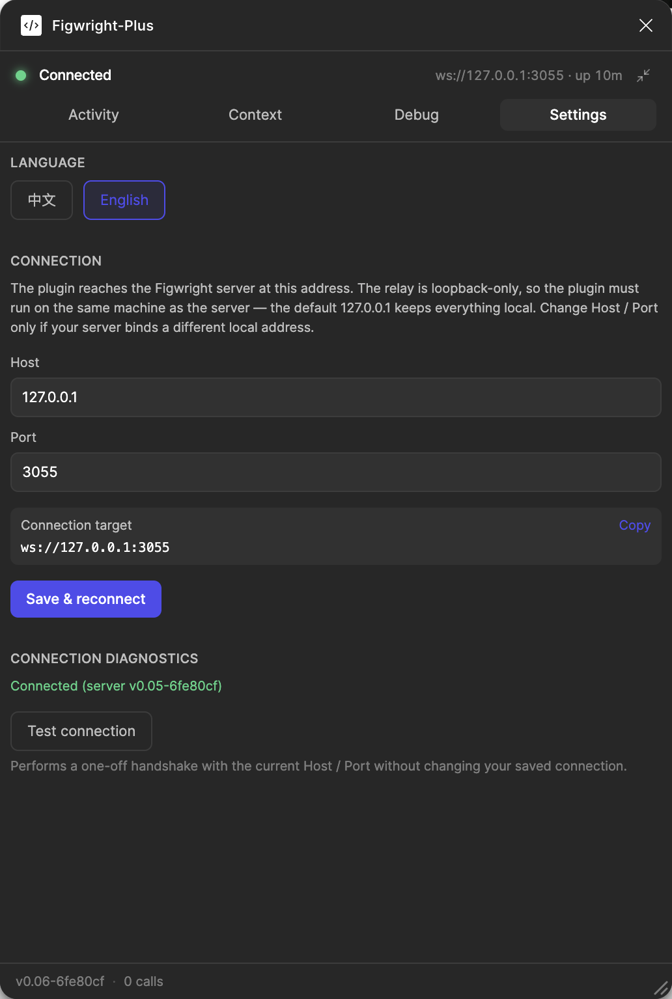
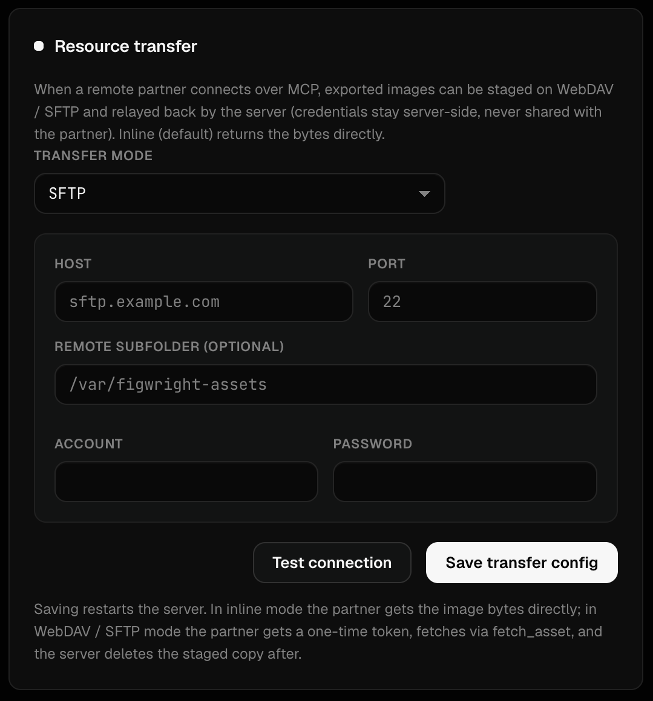

# Peers — Collaboration Guide

A **peer** is anything connected to your Figwright relay: your local Figma plugin, a teammate's plugin on another machine, or a remote AI agent driving Figma through the HTTP MCP endpoint. Figwright Plus is built so a colleague can reach *your* Figma without installing the plugin themselves.




## The three peer types

| Peer | How it connects | Use case |
| :--- | :--- | :--- |
| **Local plugin** | WebSocket to `127.0.0.1` from your own Figma | You driving Figma from your own agent |
| **Remote plugin** | WebSocket from a teammate's Figma on the LAN | A designer on another machine sharing their file |
| **Remote agent** | HTTP `/mcp` from any MCP client with a token | A frontend colleague's Cursor/VSCode reading your Figma |

## Invite a teammate (remote plugin)

The console prints a one-click invite link once the relay is up:

```
figwright://connect?host=192.168.x.x&port=3055
```

Send it to your teammate. Opening it in their Figma (with the Figwright plugin) connects their plugin to **your** relay — they don't need the plugin installed on a server, just the plugin in their Figma.

> For remote access, the relay must bind a non-loopback address. In the console **Connection** card, set the host to your LAN IP (or `0.0.0.0`) and save — the relay restarts with the new binding.

## Connect a remote agent (HTTP MCP)

A colleague's MCP client can talk to your relay directly over Streamable HTTP — no plugin on their side:

```json
{
  "mcp": {
    "servers": {
      "figwright": {
        "type": "http",
        "url": "http://192.168.x.x:3055/mcp",
        "headers": { "x-figwright-token": "TOKEN_YOU_ISSUED" }
      }
    }
  }
}
```

If their client only supports stdio MCP, bridge with `mcp-remote`:

```bash
npx -y mcp-remote http://192.168.x.x:3055/mcp --allow-http --header "x-figwright-token: TOKEN_YOU_ISSUED"
```

Both token headers work: `x-figwright-token` (Figwright-native) or standard `Authorization: Bearer <token>`. Use the **same token** you issued them.

## Token scoping (read-only vs read-write)

Issue each peer a dedicated token and decide its permission in the console **Tokens** card:

- **Read-only** — the peer can read designs and generate code, but cannot modify your Figma.
- **Read-write** — the peer can also create/edit/delete nodes on your canvas.

This is per-token, so one colleague can be read-only while another is read-write. Tokens can be added, deleted, and rotated at any time; changes take effect immediately.

## Transferring assets to peers

When an agent on a remote machine needs a generated asset back, Figwright Plus can stage it and hand it over through a transfer store instead of your local disk:

- **Inline** (default) — assets stay on your machine; fine for local use.
- **WebDAV** — zero extra dependencies; point it at your WebDAV server.
- **SFTP** — uses `ssh2-sftp-client` (install it locally with `pnpm --filter @figwright/mcp add ssh2-sftp-client`).




Use the **Test** button in each transfer card to verify credentials before saving.

## Troubleshooting

- **Peer stuck on "Waiting"** — the relay only runs while your MCP client (or the console) is up. Confirm your console/relay is running and `ping` works.
- **Colleague can't connect** — check your Mac firewall allows inbound on **3055**, and that the relay host is bound to a LAN address (not `127.0.0.1`).
- **Connected but can't edit** — they likely hold a **read-only** token. Issue a read-write token to grant write access.

---

# 同伴 — 协作指南

**同伴（peer）** 指一切连到你 Figwright 中继的对象：你本机的 Figma 插件、同事另一台机器上的插件，或通过 HTTP MCP 端点驱动 Figma 的远程智能体。Figwright Plus 的设计目标，就是让同事**无需在自己机器装插件**也能访问*你的* Figma。


## 三类同伴

| 同伴 | 连接方式 | 场景 |
| :--- | :--- | :--- |
| **本机插件** | 你自己的 Figma 经 WebSocket 连 `127.0.0.1` | 你用自己的智能体驱动 Figma |
| **远程插件** | 局域网内同事的 Figma 经 WebSocket 连入 | 另一台机器上的设计师共享其文件 |
| **远程智能体** | 任意 MCP 客户端带令牌经 HTTP `/mcp` 连入 | 前端同事的 Cursor/VSCode 读取你的 Figma |

## 邀请同事（远程插件）

中继启动后，控制台会打印一条一键邀请链接：

```
figwright://connect?host=192.168.x.x&port=3055
```

把链接发给同事。在其 Figma 中打开（需装有 Figwright 插件）即可连到**你的**中继——他们不需要在服务端装插件，只需自己 Figma 里有插件。

> 远程访问要求中继绑定非回环地址。在控制台**连接**卡片中把 host 设为你的局域网 IP（或 `0.0.0.0`）并保存，中继会以新绑定重启。

## 连接远程智能体（HTTP MCP）

同事的 MCP 客户端可直接通过 Streamable HTTP 与你的中继通信——他们那侧无需插件：

```json
{
  "mcp": {
    "servers": {
      "figwright": {
        "type": "http",
        "url": "http://192.168.x.x:3055/mcp",
        "headers": { "x-figwright-token": "你签发的令牌" }
      }
    }
  }
}
```

若其客户端仅支持 stdio MCP，用 `mcp-remote` 桥接：

```bash
npx -y mcp-remote http://192.168.x.x:3055/mcp --allow-http --header "x-figwright-token: 你签发的令牌"
```

两种令牌头都支持：`x-figwright-token`（Figwright 原生）或标准 `Authorization: Bearer <token>`。请使用你发给他的**同一条**令牌。

## 令牌分权（只读 / 读写）

在控制台**令牌**卡片为每位同伴签发专属令牌并设定权限：

- **只读** —— 同伴可读取设计并生成代码，但无法修改你的 Figma。
- **读写** —— 同伴还可在画布上创建 / 编辑 / 删除节点。

权限按令牌区分，因此可让一位同事只读、另一位读写。令牌可随时新增 / 删除 / 轮换，改动立即生效。

## 向同伴传送资源

当远程机器上的智能体需要取回生成的资源时，Figwright Plus 可将其暂存并通过传输存储交付，而非留在你本机磁盘：

- **Inline（默认）** —— 资源留在本机，本地使用足够。
- **WebDAV** —— 零额外依赖，指向你的 WebDAV 服务即可。
- **SFTP** —— 使用 `ssh2-sftp-client`（本机执行 `pnpm --filter @figwright/mcp add ssh2-sftp-client` 安装）。


每个传输卡片都有**测试**按钮，保存前可先校验凭据。

## 排错

- **同伴卡在"Waiting"** —— 中继仅在你的 MCP 客户端（或控制台）运行时才在线。确认控制台/中继在跑且 `ping` 正常。
- **同事连不上** —— 检查你 Mac 防火墙允许 **3055** 入站，且中继 host 已绑定局域网地址（非 `127.0.0.1`）。
- **连上了但不能编辑** —— 他多半拿的是**只读**令牌。签发一条读写令牌即可授予写权限。
