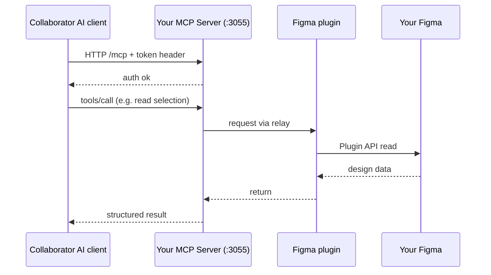

# Figwright Plus · Usage Guide (English)

> A from-zero-to-working manual. Whether you are the **designer** (running the service on your Mac and using the Figma plugin) or the **remote collaborator** (connecting to someone's Figma to generate code), you can follow the relevant sections below.

---

## 📑 Table of Contents

1. [Who this guide is for](#1-who-this-guide-is-for)
2. [Prerequisites](#2-prerequisites)
3. [Part 1: Running it on your own Mac](#3-part-1-running-it-on-your-own-mac)
4. [Part 2: Letting a remote collaborator connect to your Figma](#4-part-2-letting-a-remote-collaborator-connect-to-your-figma)
5. [Part 3: How generated images reach the collaborator's machine](#5-part-3-how-generated-images-reach-the-collaborators-machine)
6. [Part 4: Permissions and read-only mode](#6-part-4-permissions-and-read-only-mode)
7. [Part 5: The web console in detail](#7-part-5-the-web-console-in-detail)
8. [Part 6: Troubleshooting](#8-part-6-troubleshooting)
9. [Appendix: Config & environment variable reference](#9-appendix-config--environment-variable-reference)

---

## 1. Who this guide is for

| Role | What you do | Read which part |
| :--- | :--- | :--- |
| **Designer (you)** | Run the service locally, use the Figma plugin, issue tokens to collaborators | Part 1, Parts 3–5 |
| **Remote collaborator (developer)** | Use your AI client on your own machine to connect to the designer's Figma | Part 2, Part 3 |

> 💡 **One-line topology**: The **designer's Mac** runs the `MCP Server` + `Figma plugin`. The **collaborator's** AI client reaches the designer's `MCP Server` over **HTTP**, which then reads/writes Figma through the plugin.

---

## 2. Prerequisites

| Item | Requirement | Notes |
| :--- | :--- | :--- |
| **Node.js** | 22+ (24 recommended) | Check with `node -v`. |
| **pnpm** | 9+/11+ | Check with `pnpm -v`; install with `npm i -g pnpm` if missing. |
| **Figma** | Desktop app | The web app does not support the local plugin relay. |
| **OS** | macOS (designer side) | The service runs on the designer's Mac; the collaborator's OS is unrestricted. |
| **Network** | Same LAN as the collaborator | This release targets LAN-direct; cross-public-internet needs your own tunnel. |

---

## 3. Part 1: Running it on your own Mac

### Step 1 · Get the code

```bash
git clone https://github.com/heyxiaoze/figwright.git
cd figwright            # you may rename to figwright-plus
```

### Step 2 · Install dependencies

```bash
pnpm install
```

### Step 3 · Build the MCP Server

```bash
pnpm build              # builds shared / mcp / plugin packages
```

> `pnpm build` builds all three packages. The console launches the `mcp` artifact produced here.

### Step 4 · Start the console

```bash
node scripts/dashboard.mjs
```

Once started:

- It auto-opens your browser to **http://127.0.0.1:3056** (macOS opens automatically; on other systems open it manually).
- The console **auto-starts and supervises** the MCP Server (listening on `:3055`).
- The header shows the version badge (e.g. `v1.4-xxxxxxx`) and the server status.

> 🖥️ The console binds only to `127.0.0.1` (local, safe). What is actually exposed is the MCP Server (`:3055`) it supervises, bound to `0.0.0.0` so LAN collaborators can reach it.

### Step 5 · Import the plugin into Figma

The plugin must be installed in your Figma. Two options:

**Option A · Download from the GitHub Release (recommended, simplest)**
1. Open the repository's Releases page and download the latest `figwright-plus-vX.Y-*.zip`.
2. Unzip to get `manifest.json` + `dist/`.
3. In the Figma desktop app: `Menu → Plugins → Development → Import plugin from manifest…`, then select the unzipped `manifest.json`.
4. You can now open the plugin panel from `Plugins → Figwright-Plus`.

**Option B · Use your local build (developers)**
If you just ran `pnpm build`, point Figma to the in-repo `packages/plugin/manifest.json` to import.

### Step 6 · Verify the connection

After opening the Figma plugin panel, return to the console — you should see a **`local-plugin` connected** entry in the peers/connections area. Your local link is now working ✅.

> At this point you (or a local AI client) can already read/write Figma. To let a **remote collaborator** connect, continue to Part 2.

---

## 4. Part 2: Letting a remote collaborator connect to your Figma

### Topology



### Step 1 · Create a token for the collaborator in the console

1. Open the console **Tokens** card.
2. Click "New token" and fill in:
   - **label**: e.g. `Alice's VSCode`, for audit identification.
   - **readonly**: check it if the collaborator should only *read* designs (figma-to-code) and not modify your files; leave unchecked to allow writing back to the canvas.
   - **value**: auto-generated or custom.
3. After saving, copy the token's **value** and send it to the collaborator (treat it like a password, send over a private channel).

### Step 2 · Tell the collaborator your LAN IP

The console provides an **"auto-fill local IP"** button (or query the `/api/lan-ip` endpoint) that returns your current LAN address, e.g. `192.168.1.50`.

> ⚠️ The collaborator must be on the **same LAN segment** as you (e.g. same Wi-Fi/router). Cross-segment or public internet is out of scope for this release.

### Step 3 · Collaborator-side MCP client config

The collaborator adds an MCP Server in their AI client. Two common variants, pick one.

**Variant A · Native Streamable HTTP (Claude Code / newer Cursor that support `http` type)**

```json
{
  "mcpServers": {
    "figwright": {
      "type": "http",
      "url": "http://192.168.1.50:3055/mcp",
      "headers": { "x-figwright-token": "<paste the collaborator's token here>" }
    }
  }
}
```

**Variant B · Via `mcp-remote` bridge**

```json
{
  "mcpServers": {
    "figwright": {
      "command": "npx",
      "args": [
        "-y", "mcp-remote",
        "http://192.168.1.50:3055/mcp",
        "--header", "x-figwright-token:<paste the collaborator's token here>"
      ]
    }
  }
}
```

> 🔑 The token can be supplied either as the `x-figwright-token` request header or as the standard `Authorization: Bearer <token>`. They are equivalent.

### Step 4 · Verify

After the collaborator's client connects, your console's peers/connections area shows a **`remote-agent`** entry (with IP and token label). The collaborator can now ask their AI to read your Figma selection, generate code, or (if authorized) write back to the canvas.

---

## 5. Part 3: How generated images reach the collaborator's machine

When a collaborator asks the AI to "save this image", the `save_*` tools produce images. How those images get onto the collaborator's own machine depends on the **resource transfer mode** you configure.

### Mode 1 · Inline (default)

```json
{ "mode": "inline" }
```

- `save_*` results **include `base64`** directly; the collaborator decodes and writes to their own machine.
- Simplest, good for local use / small images. **Downside**: large images bloat the MCP context.

### Mode 2 · WebDAV / SFTP (staging + `fetch_asset`)

```json
{
  "mode": "webdav",
  "webdav": { "url": "https://dav.example.com/remote.php/webdav", "username": "u", "password": "p" }
}
```

```json
{
  "mode": "sftp",
  "sftp": { "host": "1.2.3.4", "port": 22, "username": "u", "password": "p" }
}
```

- `save_*` results **omit base64** and return an `assetToken` instead.
- Credentials **live only on your (server) side**; the collaborator never sees them.
- The collaborator calls `fetch_asset({ token })` over the MCP connection to pull the bytes to their own machine.
- Best for remote collaborators and large images.

### Mode 3 · Direct delivery (zero base64)

```json
{
  "mode": "webdav",
  "directUrl": true,
  "publicBaseUrl": "http://192.168.1.50:3055"
}
```

- `save_*` results return an `assetUrl` (e.g. `http://192.168.1.50:3055/asset/<token>`).
- The collaborator **GETs it directly over HTTP** to download the raw bytes; base64 never crosses MCP.
- Ensure `publicBaseUrl` is an address the collaborator can reach.

> 📌 **Collaborator rule of thumb**: In **every** mode, **do not use the `path` field** in `save_*` results — it is a server-side filesystem path and is unreachable from the collaborator's machine. Use `base64` (inline), `assetToken` + `fetch_asset` (WebDAV/SFTP), or `assetUrl` (direct).

---

## 6. Part 4: Permissions and read-only mode

- **Local is always read-write**: you (the designer), connecting over loopback, can always read and write, unrestricted by tokens.
- **Remote is scoped per token**: each collaborator token can set `readonly: true`, so that collaborator can only *read* designs and cannot write back to the canvas (ideal for code-only collaborators).
- Revocation is easy: delete the corresponding token in the console; other collaborators are unaffected.

```json
// Example token in the console / config file
{ "value": "xxxx", "label": "Alice's VSCode", "readonly": true }
```

---

## 7. Part 5: The web console in detail

The console (http://127.0.0.1:3056) is the "cockpit" for the whole stack:

| Card | Purpose |
| :--- | :--- |
| **Status** | Version, MCP Server running/connection count, local IP. |
| **Tokens** | Add/edit/delete tokens, set read-only, copy value. |
| **Transfer** | Switch inline / WebDAV / SFTP / direct, enter credentials (stored server-side only). |
| **Start/Stop** | One-click Start / Stop / Restart the MCP Server (a watchdog auto-restarts it after an unexpected exit). |
| **Activity audit** | Live `[peer]` connections and `[audit]` tool calls (who, which tool, duration, success). |
| **Theme / Language** | Dark / light, 中文 / English, preference saved locally. |

### Config file

The console stores secrets in **`scripts/.figwright-dashboard.json`** (gitignored, never committed):

```json
{
  "host": "0.0.0.0",
  "port": 3055,
  "tokens": [
    { "value": "xxxx", "label": "primary" }
  ],
  "transfer": { "mode": "inline" }
}
```

- Changes made in the console UI are written here automatically.
- You can also edit it manually and restart the console to apply.
- `host` is fixed to `0.0.0.0` (LAN mode) by the console; ordinary users need not change it.

---

## 8. Part 6: Troubleshooting

| Symptom | Likely cause | Fix |
| :--- | :--- | :--- |
| Plugin panel won't open / can't connect | MCP Server not up | Confirm `node scripts/dashboard.mjs` is running; check console "Status" shows the server online. |
| No `local-plugin` in console | Plugin not imported correctly | Re-import via `manifest.json`; confirm Figma is the desktop app. |
| Collaborator can't connect (timeout) | Firewall / segment | Ensure `3055` isn't blocked; collaborator on same segment; IP correct. |
| Collaborator gets `403 forbidden` | Wrong token | Check the token value was copied fully; header name `x-figwright-token`. |
| Collaborator "got the image but it's empty" | Used `path` | Don't use `path` (server-side); per mode use `base64` / `assetToken`+`fetch_asset` / `assetUrl`. |
| WebDAV/SFTP set but images still inline | Incomplete credentials | The console transfer card will indicate; the `note` field in `save_*` results also states the current mode. |
| Console page won't open | Service not started | Confirm `node scripts/dashboard.mjs` is running, then visit http://127.0.0.1:3056. |

---

## 9. Appendix: Config & environment variable reference

The MCP Server's behavior is driven by **environment variables**; the console simply writes these as config and passes them to the server. To run the server directly without the console, use the variables below:

| Variable | Default | Description |
| :--- | :--- | :--- |
| `FIGWRIGHT_HOST` | `127.0.0.1` | Network interface to bind. `0.0.0.0` / a LAN IP allows collaborators to connect. |
| `FIGWRIGHT_PORT` | `3055` | Server port (the plugin always connects to `3055`; usually leave as-is). |
| `FIGWRIGHT_READONLY` | empty | `1/true/yes/on` makes the **whole server** read-only (token-level `readonly` is usually finer). |
| `FIGWRIGHT_TOKEN` | empty | Single token (legacy path), becomes `label:"primary"`. |
| `FIGWRIGHT_TOKENS` | empty | Multi-token JSON array: `[{value,label?,readonly?}]`. |
| `FIGWRIGHT_TRANSFER` | empty | Resource transfer JSON (see Part 3 modes). |
| `FIGWRIGHT_ALLOW_ANY_ORIGIN` | empty | `1` relaxes CORS (debug only). |
| `DASH_PORT` | `3056` | Console port. |

> 🔒 Security reminder: once `FIGWRIGHT_HOST` is non-loopback, **pin `FIGWRIGHT_TOKEN`** (or `FIGWRIGHT_TOKENS`) and do not expose `3055` to the public internet.

---

📖 中文完整版见 **[`使用指南.md`](./使用指南.md)**（独立文件，纯中文）。
