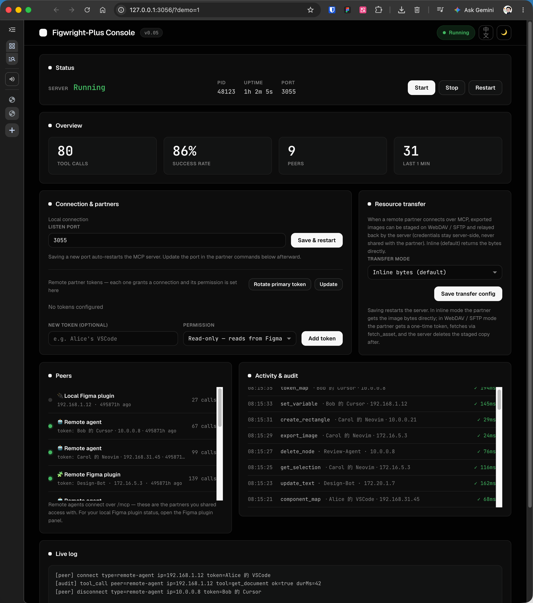
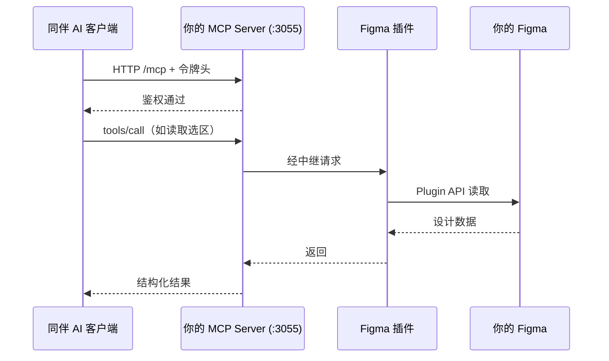
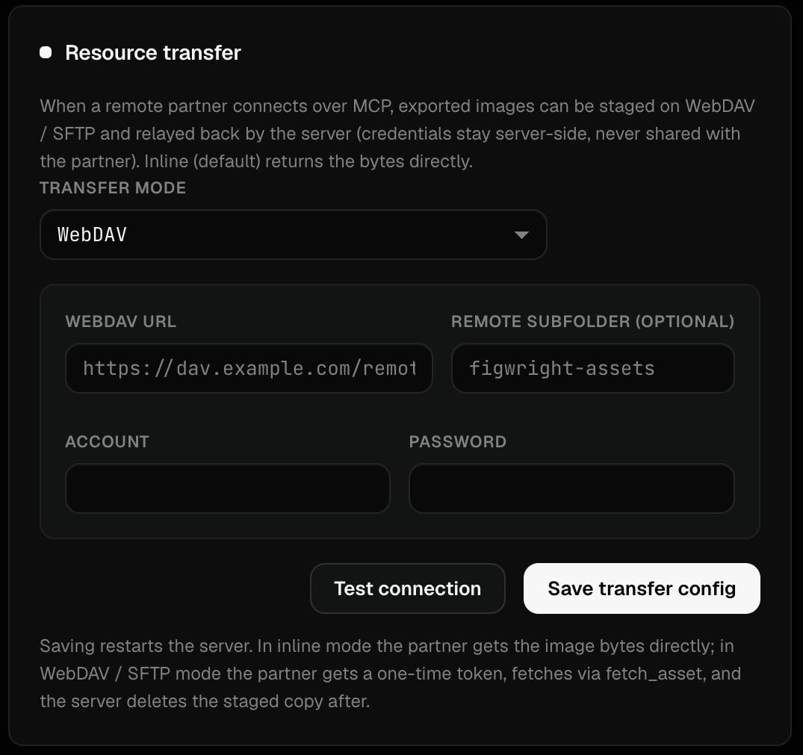

# Figwright Plus · 中文使用指南

> 一份「从零到能用」的详细手册。无论你是设计者（本机跑服务 + 用 Figma 插件），还是远程同伴（连别人的 Figma 出码），都能照着走完。

---

## 📑 目录

1. [这份指南适合谁](#1-这份指南适合谁)
2. [前置条件](#2-前置条件)
3. [第一部分：在你自己的 Mac 上跑起来](#3-第一部分在你自己的-mac-上跑起来)
4. [第二部分：让远程同伴连上你的 Figma](#4-第二部分让远程同伴连上你的-figma)
5. [第三部分：生成的图片如何送到同伴机器](#5-第三部分生成的图片如何送到同伴机器)
6. [第四部分：权限与只读](#6-第四部分权限与只读)
7. [第五部分：控制台详解](#7-第五部分控制台详解)
8. [第六部分：多文件路由与定位](#8-第六部分多文件路由与定位)
9. [第七部分：故障排查](#9-第七部分故障排查)
10. [附录：配置与环境变量速查](#10-附录配置与环境变量速查)

---

## 1. 这份指南适合谁

| 角色 | 你需要做什么 | 看哪部分 |
| :--- | :--- | :--- |
| **设计者（你）** | 在本机跑服务、在 Figma 里用插件、给同伴发令牌 | 第一部分、第三/四/五部分 |
| **远程同伴（开发者）** | 在自己的电脑上用 AI 客户端连你的 Figma 出码 | 第二部分、第三部分 |

> 💡 **一句话拓扑**：你（设计者）的 Mac 上跑着 `MCP Server` + `Figma 插件`；同伴（开发者）的 AI 客户端通过 **HTTP** 连到你的 `MCP Server`，再经插件读写你的 Figma。

---

## 2. 前置条件

| 项目 | 要求 | 说明 |
| :--- | :--- | :--- |
| **Node.js** | 22+（推荐 24） | 用 `node -v` 自查。 |
| **pnpm** | 9+/11+ | 用 `pnpm -v` 自查；没有就 `npm i -g pnpm`。 |
| **Figma** | 桌面客户端 | 网页版不支持本地插件中继。 |
| **系统** | macOS（设计者侧） | 服务跑在你的 Mac 上；同伴侧系统不限。 |
| **网络** | 与同伴在同一局域网 | 本版为局域网直连；跨公网需自行穿透。 |

---

## 3. 第一部分：在你自己的 Mac 上跑起来

### 步骤 1 · 获取代码

```bash
git clone https://github.com/heyxiaoze/figwright-plus.git
cd figwright            # 也可重命名为 figwright-plus
```

### 步骤 2 · 安装依赖

```bash
pnpm install
```

### 步骤 3 · 构建 MCP Server

```bash
pnpm build              # 构建 MCP Server（及插件）
```

> `pnpm build` 会构建 `shared` / `mcp` / `plugin` 三个包。控制台要启动的就是这里的 `mcp` 产物。

### 步骤 4 · 启动控制台

```bash
node scripts/dashboard.mjs
```

启动后：

- 自动打开浏览器，访问 **http://127.0.0.1:3056**（macOS 会自动开；其他系统手动打开）。
- 控制台会**自动启动并看护** MCP Server（监听 `:3055`）。
- 顶部能看到版本徽标（如 `v1.4-xxxxxxx`）与运行状态。

> 🖥️ 控制台只绑在 `127.0.0.1`（本机），安全。真正对外的是它看护的 MCP Server（`:3055`，绑 `0.0.0.0` 以支持局域网同伴）。

> 📸 **截图占位（待补充）**：`docs/assets/console-overview.png`
> 建议画面：控制台首屏——顶部版本徽标（如 `v1.4-…`）、状态卡（服务在线 / 本机 IP / 连接数）、「local-plugin 已连接」记录、暗色主题。
>
> 

### 步骤 5 · 在 Figma 中导入插件

插件需要装进你的 Figma。两种方式任选：

**方式 A · 从 GitHub Release 下载（推荐，最简单）**
1. 打开本仓库的 Releases 页面，下载最新的 `figwright-plus-vX.Y-*.zip`。
2. 解压后得到 `manifest.json` + `dist/`。
3. 在 Figma 桌面端：`菜单 → Plugins → Development → Import plugin from manifest…`，选中解压出的 `manifest.json`。
4. 之后在 `Plugins → Figwright-Plus` 里即可打开插件面板。

**方式 B · 用本地构建（开发者）**
若你刚跑过 `pnpm build`，可直接让 Figma 指向仓库内的 `packages/plugin/manifest.json` 导入。

### 步骤 6 · 验证连接

打开 Figma 插件面板后，回到控制台，应能在「同伴 / 连接」区域看到一条 **`local-plugin` 已连接** 的记录。至此，本机链路打通 ✅。

> 此时你（或本机的 AI 客户端）已经可以读写 Figma 了。要让**远程同伴**也能连，继续看第二部分。

---

## 4. 第二部分：让远程同伴连上你的 Figma

### 拓扑图



### 步骤 1 · 在控制台为同伴创建令牌

1. 打开控制台 **令牌** 卡片。
2. 点「新建令牌」，填：
   - **标签（label）**：如 `Alice 的 VSCode`，便于审计辨认。
   - **只读（readonly）**：若同伴只需「读设计出码」、不能改你的文件，勾选；若需要「写回画布」则不勾。
   - **值（value）**：可自动生成，也可自定义。
3. 保存后，把这条令牌的 **value** 复制发给同伴（视同密码，走私信）。

> 📸 **令牌卡片**：下方「控制台总览」已包含令牌创建区域；也可单独查看同伴列表：
>
> 

### 步骤 2 · 告诉同伴你的局域网 IP

控制台提供了一个 **「自动填本机 IP」** 按钮（或用 `/api/lan-ip` 接口查询），它会给出你当前局域网地址，例如 `192.168.1.50`。

> ⚠️ 同伴必须和你在**同一局域网网段**（如都连同一个 Wi-Fi / 路由器）。跨网段或公网不在本版支持范围。

### 步骤 3 · 同伴侧 MCP 客户端配置

同伴在其 AI 客户端里添加 MCP Server。下面给两种常见写法，二选一。

**写法 A · 原生 Streamable HTTP（Claude Code / Cursor 新版等支持 `http` 类型）**

```json
{
  "mcpServers": {
    "figwright": {
      "type": "http",
      "url": "http://192.168.1.50:3055/mcp",
      "headers": { "x-figwright-token": "<在这里填同伴的令牌>" }
    }
  }
}
```

**写法 B · 通过 `mcp-remote` 桥接**

```json
{
  "mcpServers": {
    "figwright": {
      "command": "npx",
      "args": [
        "-y", "mcp-remote",
        "http://192.168.1.50:3055/mcp",
        "--header", "x-figwright-token:<在这里填同伴的令牌>"
      ]
    }
  }
}
```

> 🔑 令牌可以用 `x-figwright-token` 请求头，也可以用标准 `Authorization: Bearer <令牌>`。两者等效。

### 步骤 4 · 验证

同伴侧客户端启动并连上后，你的控制台「同伴 / 连接」区域会出现一条 **`remote-agent`** 记录（含 IP、令牌标签）。同伴即可在对话里让它读取你的 Figma 选区、生成代码，或在获权时写回画布。

---

## 5. 第三部分：生成的图片如何送到同伴机器

当同伴让 AI「把这张图存下来」时，`save_*` 工具会产出图片。图片怎么到同伴自己机器上，取决于你配置的**资源传送模式**。

### 模式一 · 内联（Inline，默认）

```json
{ "mode": "inline" }
```

- `save_*` 结果**直接带 `base64`**，同伴解码写自己机器即可。
- 最简单，适合本机 / 小图。**缺点**：图片大会让 MCP 上下文膨胀。

### 模式二 · WebDAV / SFTP（暂存 + `fetch_asset`）

```json
{
  "mode": "webdav",
  "webdav": { "url": "https://dav.example.com/remote.php/webdav", "username": "u", "password": "p" }
}
```

```json
{
  "mode": "sftp",
  "sftp": { "host": "1.2.3.4", "port": 22, "username": "u", "password": "p" }
}
```

- `save_*` 结果**不带 base64**，改为返回 `assetToken`。
- 凭据**只存在你（服务端）**，同伴看不到。
- 同伴调用 `fetch_asset({ token })`，经 MCP 连接把字节拉回自己机器。
- 适合远程同伴、大图。

### 模式三 · 直链（Direct，零 base64）

```json
{
  "mode": "webdav",
  "directUrl": true,
  "publicBaseUrl": "http://192.168.1.50:3055"
}
```

- `save_*` 结果返回 `assetUrl`（如 `http://192.168.1.50:3055/asset/<token>`）。
- 同伴**直接用 HTTP GET** 下载原始字节，base64 彻底不经过 MCP。
- 需保证 `publicBaseUrl` 是同伴能访问到的你的地址。

> 📌 **同伴侧铁律**：无论哪种模式，**都不要用 `save_*` 结果里的 `path` 字段**——那是服务端的文件路径，同伴机器上不存在。内联用 `base64`；WebDAV/SFTP 用 `assetToken` + `fetch_asset`；直链用 `assetUrl`。

---

## 6. 第四部分：权限与只读

- **本机永远双向**：你（设计者）通过回环连接操作，始终可读可写，不受令牌限制。
- **远端按令牌分权**：每个同伴令牌可单独设 `readonly: true`，则该同伴**只能读设计、不能写回画布**（适合只出码、不碰文件的协作者）。
- 撤销很简单：在控制台删掉对应令牌即可，不影响其他同伴。

```json
// 控制台 / 配置文件里的令牌示例
{ "value": "xxxx", "label": "Alice 的 VSCode", "readonly": true }
```

---

## 7. 第五部分：控制台详解

控制台（http://127.0.0.1:3056）是整套服务的「驾驶舱」：

| 卡片 | 作用 |
| :--- | :--- |
| **状态** | 显示版本、MCP Server 运行/连接数、本机 IP。 |
| **令牌** | 增删改令牌、设只读、复制 value。 |
| **传送** | 切换内联 / WebDAV / SFTP / 直链，填写凭据（仅存于服务端）。 |
| **启停** | 一键 Start / Stop / Restart MCP Server（看门狗会在异常退出后自动拉起）。 |
| **活动审计** | 实时展示 `[peer]` 连接与 `[audit]` 工具调用（谁、哪个工具、耗时、成败）。 |
| **主题 / 语言** | 暗色 / 亮色，中文 / English，偏好本地保存。 |

> 📸 **传送卡片（WebDAV 模式示例）**：
>
> 
>
> SFTP 模式同理：
>
> 

### 配置文件

控制台把机密存在 **`scripts/.figwright-dashboard.json`**（已被 `.gitignore` 忽略，不会进仓库）：

```json
{
  "host": "0.0.0.0",
  "port": 3055,
  "tokens": [
    { "value": "xxxx", "label": "primary" }
  ],
  "transfer": { "mode": "inline" }
}
```

- 控制台 UI 改完会自动写入该文件。
- 你也可以手动编辑后重启控制台生效。
- `host` 由控制台固定为 `0.0.0.0`（局域网模式）；普通用户无需改动。

---

## 8. 第六部分：多文件路由与定位

Figwright-Plus 的插件**操作的是整个 Figma 文件，而非仅仅是当前 page**。也就是说：只要插件开着，任何工具都能读取 / 写回到文件里的**任意 page**，前提是你先「定位」到目标 page。下面分两块讲清楚：① 在一个文件里怎么定位 page；② 在多个文件同时开着插件时，服务器和同伴怎么知道你说的是「哪一个文件」。

### 8.1 在一个文件里定位 page

- 先调 `get_document` → 返回 `pages[]`，每个元素含 `id` 与 `name`（即 Figma 左侧页面列表里的全部页面）。
- 再调 `navigate_to_page({ pageId })`，把插件的上下文指针切到目标 page。
- 之后的 `get_selection` / `get_design_context` / `save_*` 等工具，针对的就是你切到的这页。
- 不切也能读别的 page：`get_document` 本身就把整份文件的页面结构一次性给你了；需要「激活某页再导出 / 写回」时才用 `navigate_to_page`。

> 💡 关键点：**当前 page 只是插件的上下文指针，不是能力边界**。未激活的 page 照样能被读（通过 `get_document` 的 `pages[]`）；要写或导出某页内容时，先 `navigate_to_page` 过去即可。

### 8.2 多文件同时开着插件：怎么定位「哪一个文件」

每个开着插件的 Figma 文件 = 一个独立的 **plugin session**。当你在好几个 Figma 文件里都开着插件时，服务器会同时看到多个 session。

**默认行为（隐式路由）**：工具调用会路由到**最近活跃的那个文件**——也就是你刚刚在 Figma 里操作过的那个文件。这对「一次只盯一个文件」的同伴最省心：它不用关心文件名，照常发指令即可。

**怎么知道现在连着哪些文件**：调 `ping` 工具，结果里的 `sessions` 段给出一张「谁连着、在哪一页」的表：

```json
{
  "sessions": {
    "routedSessionId": "session-file-a",
    "routedFileName": "Brand Kit",
    "routedPageName": "Colors",
    "all": [
      { "id": "session-file-a", "fileName": "Brand Kit",  "pageName": "Colors", "lastActivityAt": 1723900000000 },
      { "id": "session-file-b", "fileName": "Mobile App", "pageName": "Home",   "lastActivityAt": 1723899000000 }
    ]
  }
}
```

- `all[]`：所有已连接的 session，**按最近活跃时间倒序**排列，每个含 `id`、`fileName`、`pageName`、`lastActivityAt`。
- `routedSessionId` / `routedFileName` / `routedPageName`：上一次**隐式**调用实际命中的文件（即「最近活跃」的那个）。
- 控制台（http://127.0.0.1:3056）的「同伴 / 连接」区也会列出这些 session 及其文件 / 页面标签，设计者一眼就能看到现在挂着几个文件、分别在哪一页。

### 8.3 显式选文件：`sessionId`

当插件同时在好几个文件里开着、你想**精确指定**某一个文件（而不是最近活跃的那个）时，每个工具都接受一个可选参数 **`sessionId`**：

```json
// 让 get_design_context 命中 Brand Kit 文件，而非最近活跃的 Mobile App
{
  "pageId": "...",
  "sessionId": "session-file-a"
}
```

- `sessionId` 的值取自 `ping` 返回的 `all[].id`。
- **省略 `sessionId`** → 走隐式路由（最近活跃文件），行为和以前完全一致。
- `sessionId` 是**服务器侧的路由指令**：服务器在把请求转给插件前会把它从参数里剥掉——**插件永远不会看到这个字段**，也不影响文件本身。
- 服务器本地工具（`ping`、`fetch_asset`、`analyze_project` 等不针对某个文件的工具）会忽略 `sessionId`。

> 🔒 隔离说明：显式选文件只改变「这次调用打到哪个**已连接**的 Figma 文件」，不会改变令牌的权限边界（只读令牌依旧只读）。它解决的是「多文件同时在线时的寻址」问题，不是权限问题。

---

## 9. 第七部分：故障排查

| 现象 | 可能原因 | 解决 |
| :--- | :--- | :--- |
| 插件面板打不开 / 连不上 | MCP Server 没起来 | 确认 `node scripts/dashboard.mjs` 在跑；看控制台「状态」是否显示服务在线。 |
| 控制台里没有 `local-plugin` | 插件未正确导入 | 重新用 `manifest.json` 导入插件；确认 Figma 为桌面端。 |
| 同伴连不上（超时） | 防火墙 / 网段 | 确认 `3055` 未被防火墙拦截；同伴与你同网段；IP 正确。 |
| 同伴收到 `403 forbidden` | 令牌错 | 检查令牌 value 是否复制完整；header 名用 `x-figwright-token`。 |
| 同伴「拿到图但为空」 | 用了 `path` | 别用 `path`（服务端路径）；按模式用 `base64` / `assetToken`+`fetch_asset` / `assetUrl`。 |
| WebDAV/SFTP 配置后图仍走 base64 | 凭据不全 | 控制台传送卡片会提示；`save_*` 结果里的 `note` 字段也会说明当前模式。 |
| 控制台页面打不开 | 服务未启动 | 确认 `node scripts/dashboard.mjs` 在跑，再访问 http://127.0.0.1:3056。 |

---

## 10. 附录：配置与环境变量速查

MCP Server 的实际行为由**环境变量**驱动；控制台只是把这些变量以配置形式写好并传给它。如需脱离控制台直接跑 Server，可用以下变量：

| 变量 | 默认值 | 说明 |
| :--- | :--- | :--- |
| `FIGWRIGHT_HOST` | `127.0.0.1` | 绑定的网卡。`0.0.0.0` / 局域网 IP 才会允许同伴连入。 |
| `FIGWRIGHT_PORT` | `3055` | 服务端口（插件固定连 `3055`，一般不用改）。 |
| `FIGWRIGHT_READONLY` | 空 | `1/true/yes/on` 让**整个服务端**只读（通常用令牌级 `readonly` 更精细）。 |
| `FIGWRIGHT_TOKEN` | 空 | 单令牌（兼容旧路径），会变成 `label:"primary"`。 |
| `FIGWRIGHT_TOKENS` | 空 | 多令牌 JSON 数组：`[{value,label?,readonly?}]`。 |
| `FIGWRIGHT_TRANSFER` | 空 | 资源传送 JSON（见第三部分三种模式）。 |
| `FIGWRIGHT_ALLOW_ANY_ORIGIN` | 空 | `1` 时放开 CORS（一般仅调试用）。 |
| `DASH_PORT` | `3056` | 控制台端口。 |

> 🔒 安全提醒：把 `FIGWRIGHT_HOST` 设为非回环后，**务必**固定 `FIGWRIGHT_TOKEN`（或 `FIGWRIGHT_TOKENS`），不要将 `3055` 暴露到公网。

---

📖 英文完整版见 **[`Usage-Guide.md`](./Usage-Guide.md)**（独立文件，纯英文）。
